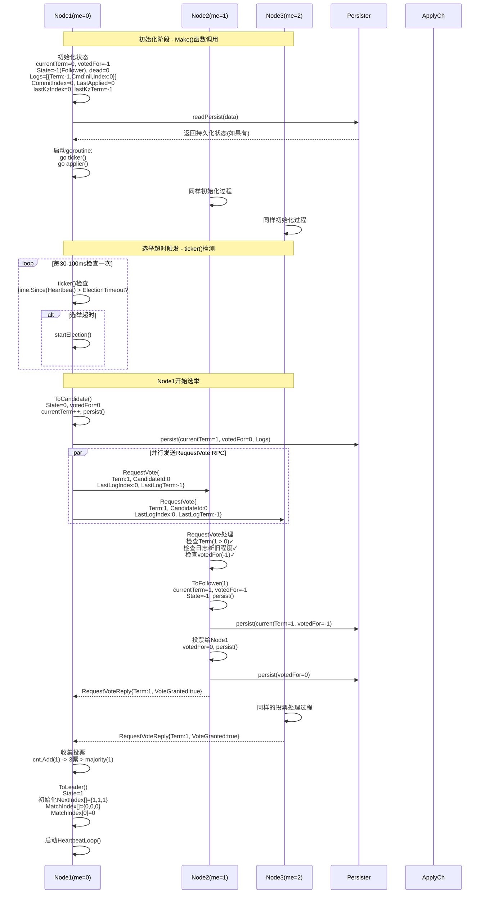
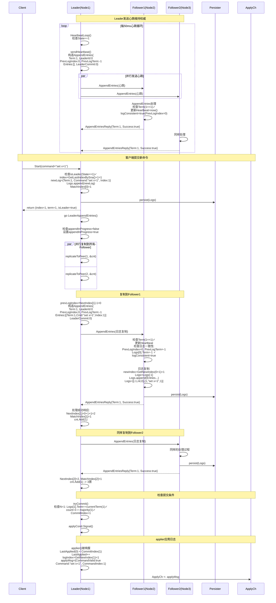
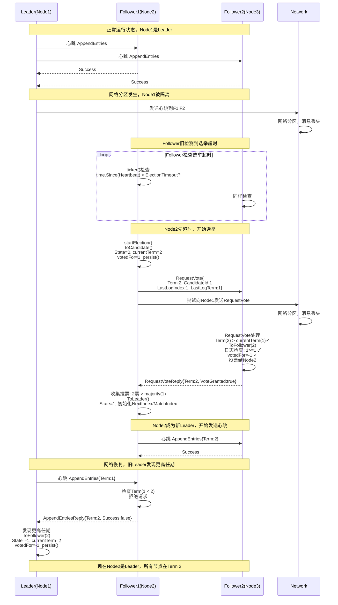
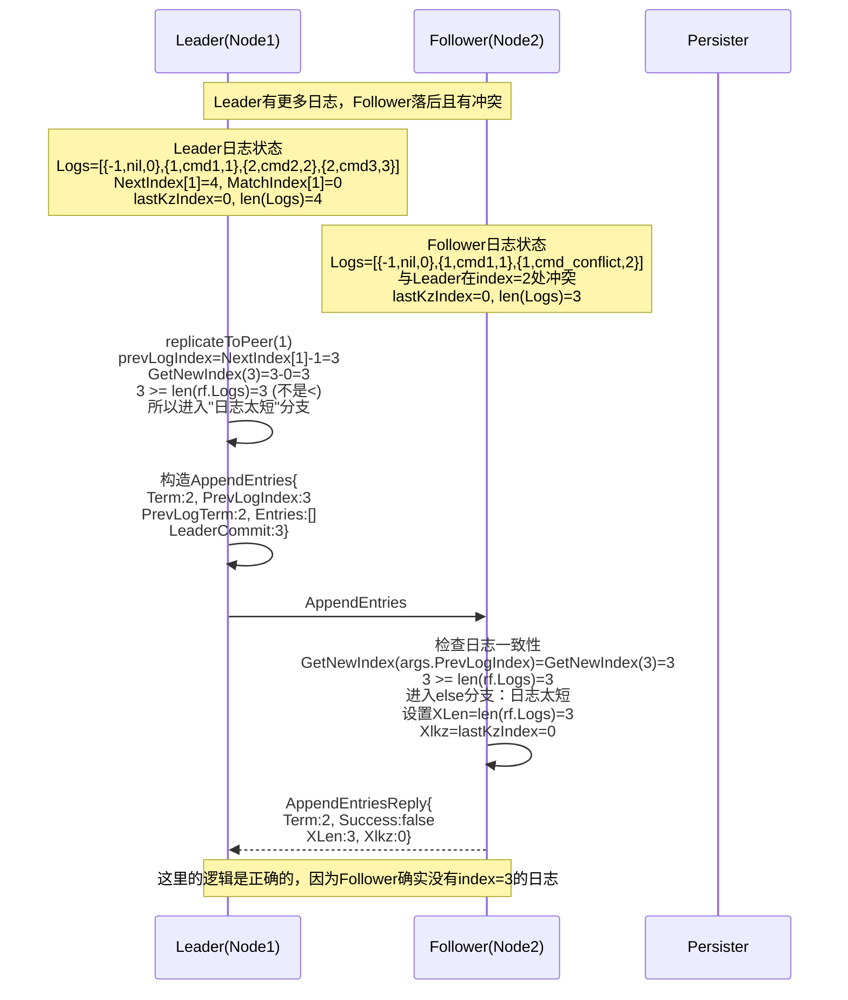
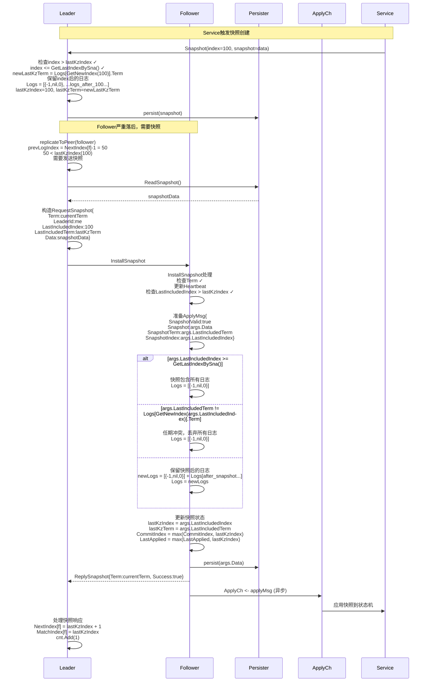
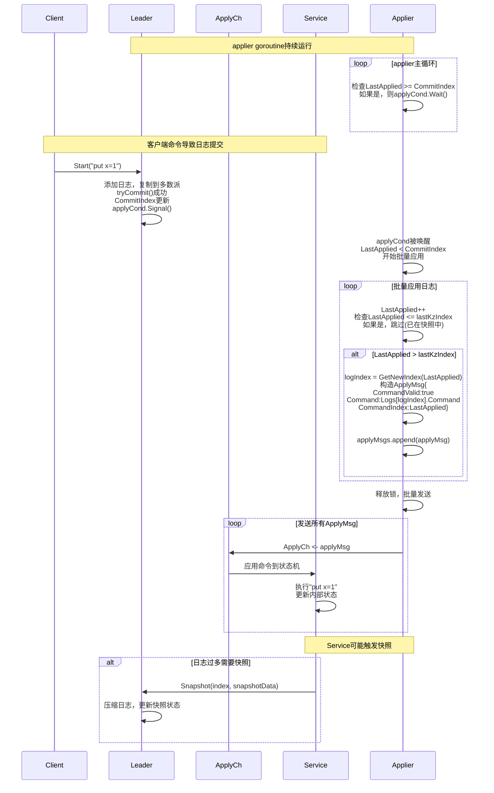
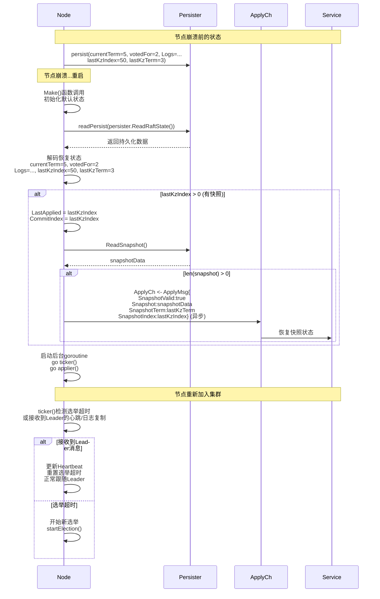

## 1. Raft节点初始化和选举流程时序图

## 2. Leader心跳和日志复制时序图

## 3. 网络分区和Leader选举时序图

## 4. 日志冲突和快速回退时序图

## 5. 快照安装时序图

## 6. 完整的状态机应用时序图

## 7. 节点故障恢复时序图

这些时序图完整展示了Raft算法的所有关键流程：

1. **初始化流程**：节点启动、状态初始化、后台goroutine启动
2. **选举流程**：选举超时、候选人竞选、投票处理、Leader确立
3. **日志复制**：心跳维持、客户端命令、日志复制、提交检查
4. **网络分区**：分区检测、重新选举、分区恢复
5. **冲突解决**：日志不一致检测、快速回退优化、冲突解决
6. **快照机制**：快照创建、快照安装、状态恢复
7. **状态应用**：applier工作流程、批量应用、状态机更新
8. **故障恢复**：持久化恢复、快照恢复、重新加入集群

每个时序图都详细展示了：
- 所有参与的组件和它们的状态
- 消息的完整内容和格式
- 状态变化的具体细节
- 错误处理和边界情况
- 并发控制和同步机制

这些时序图涵盖了Raft实现中的所有重要场景，没有任何黑盒，所有的状态变化、消息传递、持久化操作都有详细展示。